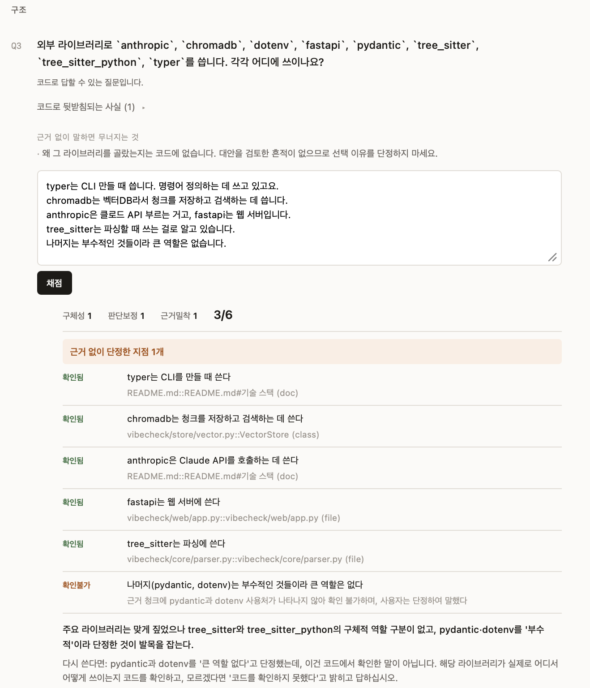
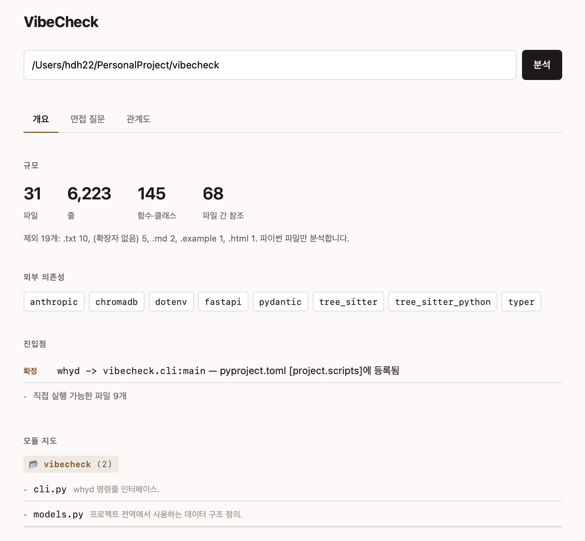
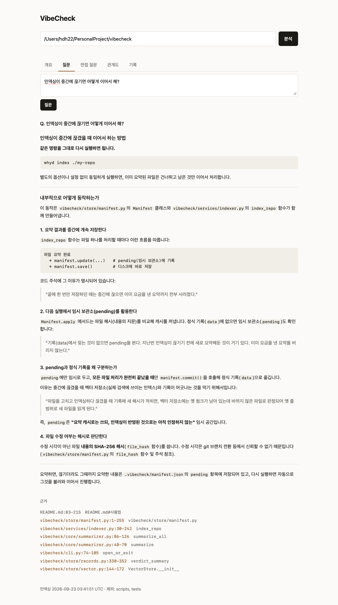
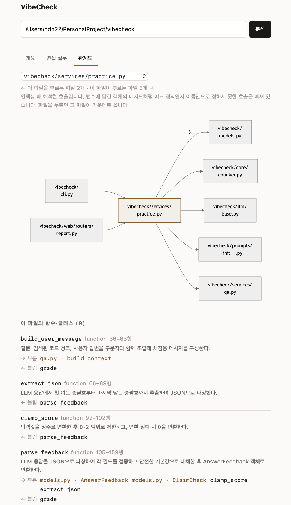

# VibeCheck

> 🚧 개발 중 (WIP)

AI로 짠 코드, 돌아가긴 하는데 설명은 못 하겠을 때.

**VibeCheck**는 레포를 인덱싱해서 그 코드에 대해 자연어로 묻고, 면접 예상질문을 만들고,
내 답변이 면접에서 통할지 채점해주는 도구입니다. CLI와 웹 화면 둘 다 씁니다.
파이썬과 Java 레포를 읽고, 독스트링도 주석도 없는 레포를 주 대상으로 합니다.



```
$ whyd ask . "채점은 어디서 처리돼?"

## 채점 처리 위치

채점은 크게 **서비스 계층**과 **웹 라우터 계층**, 두 곳에 걸쳐 처리됩니다.

### 1. 핵심 채점 로직 — `vibecheck/services/practice.py`의 `grade` 함수 (218–259행)

실제 채점이 일어나는 곳입니다. 순서는 다음과 같습니다.

1. **근거 청크 검색**: `search_union`을 호출해 질문과 사용자 답변으로 각각 벡터 검색을 수행하고, 결과를 중복 없이 합칩니다.
...

근거:
  vibecheck/services/practice.py:218-259  grade
  vibecheck/web/routers/report.py:173-239  post_practice
  vibecheck/models.py:185-191  AnswerFeedback.total
  ...
```

## 어떻게 동작하나

```
레포 → [수집] → [tree-sitter 파싱] → [청킹] → [LLM 요약] → [임베딩·벡터DB] → Q&A
```

- **tree-sitter로 파싱** — 정규식으로는 함수의 시작·끝 범위나 클래스 소속을 알아낼 수 없습니다
- **코드에 요약문을 붙여 임베딩** — 사용자는 "로그인"이라 묻지만 코드엔 `verify_token`만 있습니다. 경로·심볼명·요약·코드를 합쳐 임베딩해서 그 간극을 요약이 메웁니다
- **답변에 근거 청크를 함께 표시** — 모델 말만 믿지 않고 원본 코드로 확인할 수 있게
- **해시 기반 캐싱** — 바뀐 파일만 다시 요약합니다
- **두 계층으로 인덱싱** — 함수·클래스 단위(L2)와 파일 단위(L1). "이 파일이 무슨 라이브러리를 쓰나" 같은 질문은 함수 안에 답이 없어 파일 단위 개요가 필요합니다
- **언어마다 다른 것은 한곳에** — 확장자, 문법, 무엇을 클래스·함수로 볼지, import와 파일 설명을 읽는 법을 언어 설정 하나로 묶었습니다. Java의 Javadoc은 선언 밖에 있어서 선언 바로 앞의 문서 주석까지 청크에 넣습니다

## 설치

```bash
git clone https://github.com/ahrdyrxkddhfl/vibecheck.git
cd vibecheck

python3 -m venv .venv
source .venv/bin/activate
pip install -e .
```

API 키 설정:

```bash
cp .env.example .env
# .env 파일에 ANTHROPIC_API_KEY 입력
```

테스트:

```bash
pip install -e ".[dev]"
pytest
```

실제로 났던 버그와 한 번 정한 규칙을 고정해둔 테스트입니다. 파일 수집과 README 청킹, 인덱싱 중단 뒤 이어하기, 근거 중복, import가 레포 안을 가리키는지 가르는 규칙, 기록 저장이 실패해도 채점·답변 결과를 버리지 않는 것, 서버를 켠 채 다시 인덱싱해도 새 인덱스로 찾는 것, 앞 질문에 이어 물을 때 모델에 넘기는 것, 그리고 Java 지원에서 처음 확인한 규칙(Javadoc 범위, 오버로딩한 메서드의 id) 같은 것들입니다.

## 빠른 시작

```bash
whyd index ./my-repo
whyd serve ./my-repo
```

브라우저가 열리면서 그 레포의 개요 화면이 바로 뜹니다.

## 사용법

### 1. 인덱싱

```bash
whyd index ./my-repo
```

인덱스는 대상 레포 안의 `.vibecheck/`에 저장됩니다.
레포마다 자기 인덱스를 갖게 되어 다른 레포의 코드가 섞이지 않습니다.

요약은 파일마다 동시에 4개씩 보냅니다. 큰 레포는 몇 분 걸릴 수 있는데,
중간에 끊어도 그때까지 요약한 것은 저장되어 다시 인덱싱하면 이어서 합니다.

특정 폴더를 빼려면:

```bash
whyd index ./my-repo --exclude tests --exclude migrations
```

### 2. 질문하기

```bash
whyd ask ./my-repo "API 키는 어떤 순서로 찾아져?"
```

답변과 함께 근거 청크의 파일·줄 번호가 표시됩니다.
질문과 답은 기록에 남아 웹 기록 탭에서 다시 볼 수 있습니다. 근거를 찾지 못한 답은 남기지 않습니다.

### 3. 리포트 생성

```bash
whyd report ./my-repo
```

레포 전체 개요를 마크다운으로 만듭니다. 목차는 "면접에서 이 레포를 설명해야 한다면
무엇을 알아야 하는가"에서 역산했습니다.

1. 이 프로젝트는 무엇인가
2. 규모
3. 외부 의존성 — 표준 라이브러리와 분리해서 표시
4. 진입점 — 등록된 것과 추정한 것을 구분
5. 모듈 지도 — 파일별 심볼과 각각의 역할
6. **물어볼 만한 지점** — 코드에 남아 있지만 이유는 적혀 있지 않은 곳

6번이 이 도구의 차별점입니다. `tree`나 README로는 나오지 않고 코드를 읽어야만 보입니다.

### 4. 면접 예상질문

```bash
whyd interview ./my-repo
```

개요 → 구조 → 설계 결정 순으로 예상질문을 만듭니다. 실제 면접이 흘러가는 순서입니다.

**답은 주지 않습니다.** 답을 함께 주면 외우게 되기 때문입니다.
대신 질문마다 **답변 전략**을 붙입니다 — 어디까지가 코드로 답할 수 있는 부분이고,
어디부터가 단정하면 위험한 추측인지를 구분해줍니다.

### 5. 답변 채점

```bash
whyd practice ./my-repo -n 3 -f my-answer.txt
```

`interview`가 만든 3번 질문에 대한 답변을 채점합니다.
질문을 직접 지정하려면 `-q "질문 내용"`을 씁니다.

채점 기준은 **내용이 맞았는가**가 아니라 **면접에서 통할 답인가**입니다.
"왜 이렇게 짰는가"의 정답은 코드에 남아 있지 않은 경우가 많아
내용 일치로는 채점할 수 없기 때문입니다.

| 축 | 보는 것 |
|---|---|
| 구체성 | 파일명·함수명·동작을 짚었는가 |
| **판단보정** | 코드에 없는 것을 단정하지 않았는가 |
| 근거밀착 | 일반론이 아니라 이 레포 얘기인가 |

두 번째가 핵심입니다.
"확장성 때문입니다"는 위험하고, "확장성일 수도 있으나 코드에 근거는 없습니다"가
좋은 답입니다. 후자는 오히려 코드를 제대로 읽었다는 증거가 됩니다.

**답을 알려주지는 않습니다.** 어느 파일을 확인하고 오라고만 합니다.
답을 함께 주면 코드가 아니라 피드백 문장을 외우게 되기 때문입니다.

### 6. 연습 기록

```bash
whyd history ./my-repo
```

지금까지의 채점 기록과 누적 경향을 봅니다.
개별 점수보다 **근거 없이 단정한 횟수**의 누적을 위에 표시합니다.
한 번 단정한 것은 실수지만 반복하면 습관이기 때문입니다.

질문 기록은 건수만 알리고, 답과 근거는 웹 기록 탭에서 봅니다.
누적은 채점된 주장으로만 셉니다. 채점된 적 없는 질문이 섞이면 그 숫자가 흐려지기 때문입니다.

### 7. 웹 화면

```bash
whyd serve ./my-repo
```



개요, 질문, 면접 질문, 관계도, 기록 다섯 탭으로 보여줍니다.
질문 탭에서 레포에 묻고, 면접 질문 탭에서 답을 쓰고 채점받고,
기록 탭에서 누적 경향과 답변별 판정, 지난 질문과 답을 봅니다.

질문 탭의 답은 `whyd ask`와 같은 검색과 모델로 만듭니다. 근거 파일을 누르면 관계도 탭에서 그 파일이 열립니다.
답은 마크다운이라 HTML로 그리되, 모델이 쓴 글에 섞인 태그가 실행되지 않게 걸러서 넣습니다.

답 아래에서 이어서 물으면 앞 대화를 이어받습니다. "그거 지우는 기능도 있어?"처럼 앞을 가리키는 질문은
직전 질문을 붙여 검색하고, 앞선 대화는 무엇을 가리키는지 알아내는 데만 씁니다. 사실의 근거는 여전히
그 질문에서 찾은 코드뿐이라, 앞 답을 근거로 이어받지 않습니다. 다른 주제로 넘어갈 때는 '새 질문'을 누릅니다.



레포 경로를 생략하면 빈 화면에서 경로를 입력해 시작합니다.
서버를 켠 채로 다른 터미널에서 다시 인덱싱해도 다음 질문부터 새 인덱스로 답합니다.
개요와 관계도의 파일 목록은 '분석'을 다시 누르면 새 인덱스로 바뀝니다.

면접 질문의 근거는 접어둡니다. 펼쳐두면 답하기 전에 읽게 되기 때문입니다.

관계도는 파일 하나를 가운데 두고, 그 파일을 부르는 파일과 그 파일이 부르는 파일을 잇습니다.
파일을 누르면 그 파일이 가운데로 오고, 아래에는 함수마다 무엇을 부르고 어디서 불리는지가 붙습니다.
레포 전체를 한 장에 그리면 모두가 쓰는 파일에서 화살표가 얽혀 읽을 수 없기 때문에 이웃만 그립니다.
Java 파일은 호출 대신 코드에 나온 클래스 이름으로 잇습니다. 필드·매개변수·`new`·정적 멤버로 쓰면 연결로 보고,
메서드 단위 호출은 분석하지 않아 아래 함수 목록에는 부르는 것과 불리는 곳이 붙지 않습니다.
다른 패키지에 같은 이름의 클래스가 있으면 어느 쪽인지 짐작하지 않고 잇지 않습니다.



| 옵션 | 용도 |
|---|---|
| `--port`, `-p` | 8000번이 이미 쓰이고 있을 때 |
| `--no-browser` | 브라우저를 자동으로 열지 않기 |
| `--reload` | 코드 변경 시 자동 재시작 (개발용) |

## 요구 사항

- Python 3.11+
- Anthropic API 키

## 기술 스택

| 용도 | 사용 |
|---|---|
| 파싱 | tree-sitter (파이썬, Java) |
| LLM | Anthropic (요약: Haiku / 답변: Sonnet) |
| 벡터 검색 | ChromaDB |
| 임베딩 | `paraphrase-multilingual-MiniLM-L12-v2` |
| CLI | Typer |
| 웹 | FastAPI, 단일 HTML (Mermaid 관계도, marked + DOMPurify 답변 표시) |
| 기록 저장 | SQLite |

## 검증

외부 레포(문서화가 거의 없는 실제 오픈소스)에 질문 15개를 던져 측정했습니다.
질문과 채점 기준은 인덱싱 전에 확정했고, 코드를 주지 않은 조건(네거티브 컨트롤)을
먼저 측정해 검색이 실제로 기여한 몫을 분리했습니다.

| 조건 | 답변 품질 |
|---|---|
| 코드 미제공 (컨트롤) | 4/27 |
| 인덱스 제공 | **23/27** |

환각 0건. 답할 수 없을 때는 무엇이 없어서 답할 수 없는지를 밝혔습니다.

측정 과정과 원자료는 [`experiments/`](experiments/)에 있습니다.
Java 지원을 더할 때 파이썬 결과가 바뀌지 않았는지 확인한 과정은 [`experiments/java_support.md`](experiments/java_support.md)에,
인덱싱 중단·재개와 요약 속도를 잰 과정은 [`experiments/indexing_resume_and_speed.md`](experiments/indexing_resume_and_speed.md)에 있습니다.

## 알려진 한계

독스트링이 없는 코드에서도 **무엇을 하는 코드인지**는 대체로 복원됩니다.
하지만 **왜 그렇게 짰는지**, 특히 검토했다가 버린 대안 같은 건 코드에 흔적이 남지 않아 복원할 수 없습니다.
이 경우 VibeCheck는 추측하지 않고 "코드에서 확인할 수 없다"고 답합니다.

이건 도구의 결함이 아니라 코드라는 매체의 한계입니다.
그래서 `interview`는 그런 질문에 "단정하지 말라"는 경고를 붙입니다.

### 동작상 제약

위가 매체의 한계라면 아래는 아직 고치지 않은 것들입니다.

**파이썬과 Java만 분석합니다.** 다른 언어 파일은 인덱싱되지 않고,
확장자별로 세어 CLI·리포트·웹에 모두 표시합니다.
처음에는 파이썬만 읽어서, 자바와 파이썬이 섞인 레포에서 360개 파일 중 9개만 분석된 적이 있습니다.

**Java에서는 호출 관계와 설계 결정 질문이 없습니다.**
호출 관계는 이름으로 호출 대상을 좁히는 규칙이 파이썬 import 방식에 맞춰져 있는데,
Java는 오버로딩과 인터페이스 주입이 흔해 이름만으로는 어느 구현을 부르는지 정할 수 없습니다.
틀린 화살표를 긋는 대신 그리지 않습니다. 관계도는 대신 코드에 나온 클래스 이름으로 파일을 잇는데,
어느 파일이 어느 파일을 쓰는지는 보여도 어느 메서드가 어느 메서드를 부르는지는 보이지 않습니다.
설계 결정 질문의 재료(코드에 남은 특이 지점)는
파이썬 문법 트리로 찾고 있어 Java 파일은 건너뜁니다. 질의응답, 나머지 면접 질문, 채점은 됩니다.

**모노레포에서 로컬 패키지가 외부 의존성으로 잡힙니다.**
서비스마다 패키지 루트가 따로 있는 구조에서, 내부 모듈 이름 집합은
레포 루트를 기준으로 만들어지기 때문입니다.
의존성 목록뿐 아니라 `interview`가 만드는 질문 문장에도 그대로 들어가
"왜 이 라이브러리를 골랐나요"의 대상이 됩니다.

**외부 import가 끝이 같은 내부 이름과 겹치면 내부로 잡힙니다.**
내부 판별은 import 이름의 앞을 잘라가며 레포 안의 이름과 대조합니다.
레포 루트에 `config.py`가 있으면 `logging.config`도, 레포에 한 조각짜리 Java 패키지 `util`이 있으면
`org.example.util.*`도 끝이 같아 내부로 판정되고 의존성 목록에서 빠집니다.
실행 위치에 따라 내부 모듈이 `pkg.config`로도 `config`로도 잡히는 것을 받아내려고 부분 일치를 허용한 대가입니다.

**README는 마크다운만 절 단위로 나뉩니다.**
`.rst`나 확장자 없는 README는 요약 재료로는 읽히지만 검색 대상 청크가 되지 않습니다.
절을 나누는 규칙이 마크다운 헤딩에 기대고 있기 때문입니다.

**상위 디렉터리를 가리키는 심볼릭 링크가 있으면 수집이 멈추지 않습니다.**
디렉터리 순회가 링크를 따라가 같은 곳을 다시 훑습니다.

## 로드맵

- [x] CLI 명령 연결
- [x] 레포 리포트 생성
- [x] 예상 질문 자동 생성
- [x] 답변 채점 — 답을 쓰면 면접에서 통할 답인지 피드백
- [x] 연습 기록 저장과 누적 경향 조회 (SQLite)
- [x] 분석하지 못한 파일을 밝히기
- [x] 호출 관계 조회 — 질문하면 그 함수를 부르는 곳까지 찾아 답변 근거에 넣음
- [x] 웹 인터페이스 — 개요, 질문하기, 면접 질문과 답변 채점, 파일을 누르며 따라가는 호출 관계도
- [x] 질문 기록 — 지난 질문과 답, 근거를 기록 탭에서 다시 보기
- [x] Java 지원 — 질의응답, 면접 질문, 채점 (호출 관계 제외)
- [x] 웹에서 연습 기록 보기 — 누적 경향과 답변별 판정
- [x] 질문 이어가기 — 앞의 답을 이어받아 되묻기 (웹)
- [ ] 타자 연습
- [ ] 라인별 코드 설명
- [ ] BYOK 지원

## 라이선스

MIT